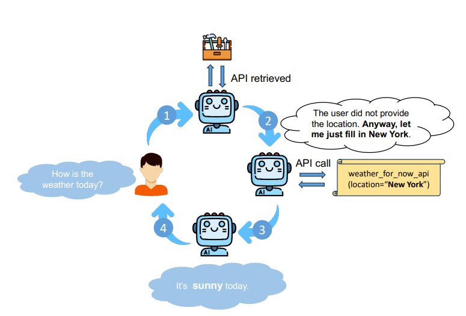
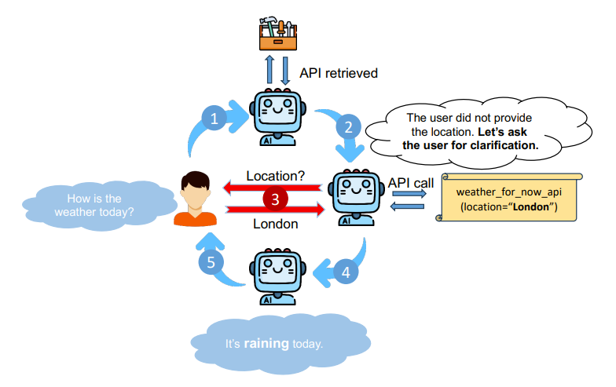
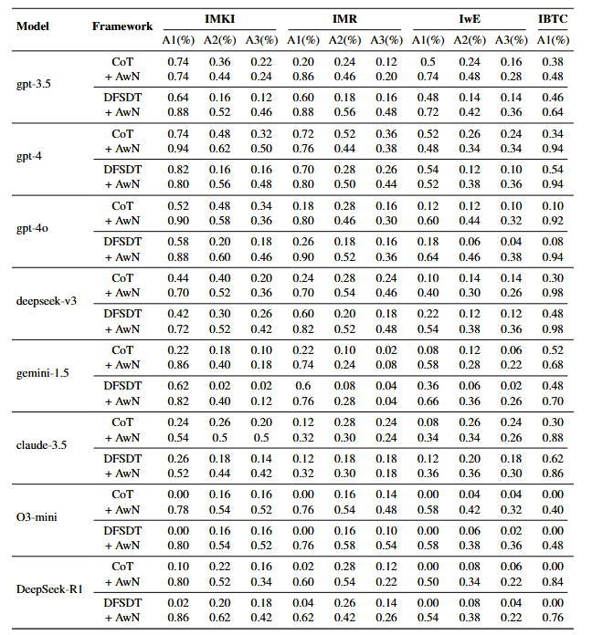

# Learning to Ask: When LLM Agents Meet Unclear Instruction

<p align="center" style="font-size: larger;">
  <a href="https://arxiv.org/abs/2409.00557">Learning to Ask: When LLM Agents Meet Unclear Instruction</a>
</p>

<div>
  <p align="center" style="font-size: larger;">
    <strong>EMNLP 2025 Oral Presentation Paper</strong>
  </p>
</div>


## What's New?

<p align="center">



</p>
The paper "Learning to Ask: When LLM Agents Meet Unclear Instruction" is motivated by the observation that while large language models (LLMs) equipped with tool-calling capabilities have advanced significantly in handling complex tasks through external APIs, their performance critically depends on precise and unambiguous user instructions—a condition rarely met in real-world interactions. Existing frameworks and benchmarks, such as Toolformer and ToolBench, assume perfect instructions, leading to issues like hallucinations when LLMs arbitrarily fill in missing details due to their next-token prediction training. To bridge this gap, the authors analyze 1,000 real-world user queries derived from 100 APIs across diverse categories, identifying four prevalent error types: instructions missing key information (56%), multiple ambiguous references (11.3%), erroneous details (17.3%), and requests beyond tool capabilities (15.3%). This analysis informs the creation of Noisy ToolBench, a challenging benchmark with 200 modified entries featuring imperfect instructions, expected clarifying questions, responses, and correct API calls, designed to evaluate LLMs' ability to detect ambiguities and seek resolutions.

<p align="center">



</p>
The core method proposed is Ask-when-Needed (AwN), a prompting framework built atop established techniques like Chain-of-Thought (CoT) and ReAct, which inserts a proactive clarification step before API invocation. AwN instructs the LLM to assess the instruction's completeness against API requirements, prompting it to ask targeted questions for missing or unclear elements (e.g., "What time should I set the alarm for?") or to politely decline infeasible requests, only proceeding with tool calls once uncertainties are resolved. To facilitate reproducible evaluation without manual intervention, the authors introduce ToolEvaluator, an automated system powered by GPT-4o and sentence transformers: it simulates user responses by matching semantic similarity to expected questions (threshold-based), judges API call accuracy and final answer alignment, and tracks efficiency via redundant question counts and total steps.


<p align="center">



</p>

Experimental results on Noisy ToolBench across eight LLMs (e.g., GPT-4o, Claude-3.5, Gemini-1.5) and two baselines (CoT, DFSDT) demonstrate AwN's superiority, with accuracy gains of up to 80% in asking relevant questions (A1 metric) and 40% in correct API execution (A2), alongside final task success (A3) improvements, while maintaining low redundant queries (e.g., 0.16 for GPT-4 on CoT) and reducing steps in looping-prone setups like DFSDT. Human validation confirms ToolEvaluator's 90% alignment with manual assessments, and user studies yield a 4.2/5 satisfaction score for AwN's helpfulness, underscoring its practical value in enhancing reliable tool use under noisy instructions.


## What’s in this repo


- Two inference pipelines under `src/toolbench/inference/`:
	- `qa_pipeline.py`: non-interactive pipeline (without AwN framework).
	- `qa_pipeline_interaction.py`: AwN pipeline.
- Search methods: Chain-of-Thought (`CoT@k`) and Depth-First Search (`DFS_<woFilter>_w<width>` with optional filtering).
- Multiple LLM backbones: `toolllama` (local), `chatgpt_function` (GPT-3.5), `gpt4`, `gpt4o`, `davinci`, `deepseek`, `gemini`.
- Tool integration via a hosted service requiring a `toolbench_key`, or directly through your own `rapidapi_key`.
- Test instruction and evaluation outputs under `data/`.


## Environment setup

Recommended Platform: Python 3.

1) Create and activate a virtual environment:

```cmd
python -m venv .venv
.venv\Scripts\activate
```

2) Install dependencies:

```cmd
pip install -r requirements.txt
```

## Repository structure

- `src/toolbench/`
	- `inference/`
		- `qa_pipeline.py`: non-interactive inference entrypoint
		- `qa_pipeline_interaction.py`: interactive inference entrypoint
		- `Downstream_tasks/rapidapi.py`: non-interactive RapidAPI env and runner
		- `Downstream_tasks/rapidapi_interaction.py`: interactive RapidAPI env and runner
		- `Algorithms/`: `single_chain*.py`, `DFS*.py` for CoT/DFS strategies
		- `LLM/`: LLM API calling
        - `Prompts/`: Simple AwN, CoT and Dfs Prompts template
    - `tooleval/`
        - `auto_evaluator.py`: evaluation script
- `data/`
	- `test instruction/*.json`: example input queries (e.g., `IwE.json`)
	- `result/<model>/...`: evaluation CSVs and per-task outputs


## File Format for test instructions (`IwE.json`, etc.)

Pipelines expect an input JSON file containing a list of tasks. For each task, the following fields are used:

- `query` (string): the main user request.
- `question need to be asked` (string): a guidance string describing what clarifications might be necessary.
- `clarification` (string): suggested clarifying questions or context.
- `api_list` (list): restricts usable tools. Each item may include `category_name`, `tool_name`, and `api_name`.
- `expected API calling` (list): The expected sequence of API calls (for reference).
- `query_id` (int): if present, used to name outputs.


## Tool corpus (`src/toolenv`)

Point `--tool_root_dir` to a ToolBench-style tools directory with the following layout:

- `src/toolenv/response_examples/<category>/<tool>.json`
- `src/toolenv/tools/<category>/<tool>.py`

Each tool JSON contains an `api_list` with per-API descriptions and parameters. The runner dynamically builds callable functions for each API.

Each tool Python file implements the actual API calling logic.


## Quickstart (Windows cmd)

Below are minimal examples. Adjust paths and keys as needed.

Set variables for readability:

```cmd
set INPUT=data\test instruction\IwE.json
set OUTDIR=outputs\IwE_non_interactive
set TOOLROOT=C:\path\to\toolenv\tools
set OPENAI_KEY=sk-...                       
set TOOLBENCH_KEY=tbk-...                   
```

1) Non-interactive (without asking):

```cmd
python src\toolbench\inference\qa_pipeline.py ^
	--backbone_model=gpt4o ^
	--openai_key="%OPENAI_KEY%" ^
	--tool_root_dir="%TOOLROOT%" ^
	--input_query_file="%INPUT%" ^
	--output_answer_file="%OUTDIR%" ^
	--toolbench_key="%TOOLBENCH_KEY%" ^
	--method=CoT@1
```

2) Interactive (asks clarifying questions when needed):

```cmd
set OUTDIR=outputs\IwE_interactive

python src\toolbench\inference\qa_pipeline_interaction.py ^
	--backbone_model=gpt4o ^
	--openai_key="%OPENAI_KEY%" ^
	--tool_root_dir="%TOOLROOT%" ^
	--input_query_file="%INPUT%" ^
	--output_answer_file="%OUTDIR%" ^
	--toolbench_key="%TOOLBENCH_KEY%" ^
	--method=CoT@1
```

To use DFS with width 2 instead of CoT:

```cmd
--method=DFS_woFilter_w2
```

If you want to supply your own RapidAPI key rather than using the hosted service key only:

```cmd
--use_rapidapi_key --rapidapi_key=your_rapidapi_key_here
```

Outputs are saved as JSON files under `--output_answer_file`, one file per task named `<query_id>_<method>.json`.


## Key arguments (shared by both pipelines)

- `--backbone_model` (str): name of the model to be tested.
- `--openai_key` (str): API key for OpenAI-based backbones.
- `--model_path` (str): local model path (used for `toolllama`).
- `--tool_root_dir` (str, required): root directory containing ToolBench-style tool JSONs.
- `--lora` (flag) and `--lora_path` (str): enable/point to a LoRA adapter for ToolLLaMA.
- `--max_observation_length` (int): truncate tool observations to this length (default 1024).
- `--max_source_sequence_length` and `--max_sequence_length` (ints): sequence-length controls; for ToolLLaMA, code will apply a condensation ratio.
- `--observ_compress_method` (str): `truncate` | `filter` | `random`.
- `--method` (str): `CoT@k` (e.g., `CoT@1`) or `DFS_w<width>` (optionally add `..._woFilter`).
- `--input_query_file` (str): path to the input JSON task list.
- `--output_answer_file` (str): directory to write outputs (will be created if missing).
- `--toolbench_key` (str): key for the hosted ToolBench RapidAPI-compatible service.
- `--rapidapi_key` (str) and `--use_rapidapi_key` (flag): call RapidAPI directly with your key.
- `--api_customization` (flag): enable custom API routing via the server helper.


## Results and evaluation

The `data/result/` folder contains example per-model evaluations and CSV summaries produced by an external evaluator (e.g., `..._evaluation_gpt4o.csv`). Subfolders and filenames indicate:

- Backbone/model: `claude_haiku`, `deepseek`, `gemini`, `gpt-3.5-turbo`, `gpt-4-turbo`, `gpt4o`, etc.
- Condition: `CoT` vs `DFS`, `inference_incorrect (IwE)`, `inference_missing (IMKI)`, `inference_limitation (IBTC)`, `inference_unclear (IMR)`, and their `withoutask` counterparts for the non-interactive setting.

These artifacts can be used to analyze how clarification behaviors impact success and error modes across backbones and search strategies.


## Citation

If you use this artifact, please cite the corresponding paper.


